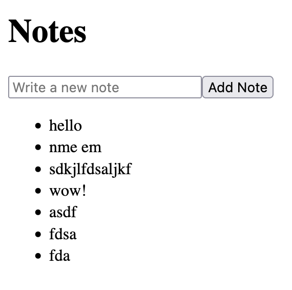

* Gave up on indentation
* Told me to run `npx convex codegen` - not sure if that's a real command, but `npx convex dev` handles that already.
* It didn't tell me to run `npm run dev`
* Something is still wrong with envvars for `process.env` even if Convex has already set up the `.env.local`.

```md
5. **Setup environment variables**

   Ensure to set up your environment variable for `VITE_CONVEX_URL`, normally set via `.env` file or directly in `vite.config.js`.

   ```plaintext
   VITE_CONVEX_URL=<YOUR_CONVEX_URL_HERE>
```

I don't have to do this because `convex` already set it up ^

had to make a change

old
```jsx
   const convex = new ConvexReactClient(process.env.VITE_CONVEX_URL);
```

new
```jsx
   const convex = new ConvexReactClient(import.meta.env.VITE_CONVEX_URL);
```

It works!!



Things to change
* Tell ChatGPT what `convex dev` does (it's a server that auto syncs & generates, and also creates the `convex/` folder as well as an `.env.local` with the convex URL
* Tell ChatGPT how vite handles envvars
